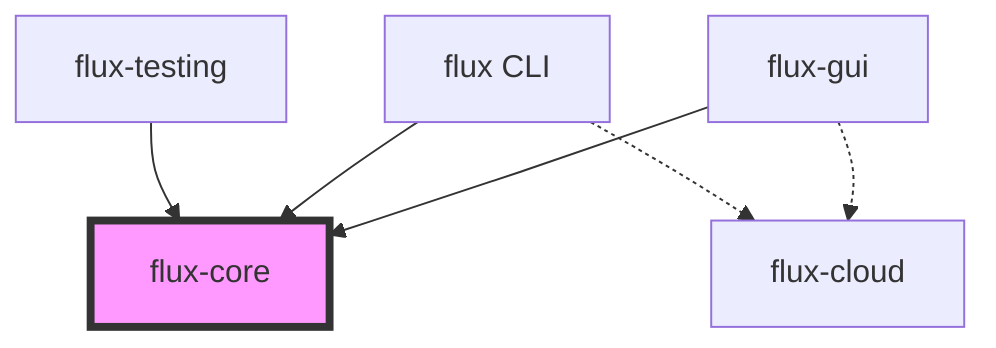

# Flux 项目结构

## 概览

Flux 项目采用了模块化的架构设计，将核心功能、应用程序和测试工具清晰地分离。

```
flux-repository/
├── .github/                # GitHub Actions 和配置
├── assets/                 # 项目资源文件
├── docs/                   # 项目文档
├── scripts/                # 开发和构建脚本
│
├── crates/                 # 所有 Rust crate
│   ├── flux/              # CLI 主程序 (二进制)
│   ├── flux-gui/          # GUI 主程序
│   ├── flux-core/         # 核心功能库
│   ├── flux-cloud/        # 云存储适配层
│   └── flux-testing/      # 测试工具库
│
├── examples/              # 使用示例
├── benches/               # 性能测试
│
├── Cargo.toml            # Workspace 根配置
├── README.md             # 项目说明
├── CHANGELOG.md          # 变更日志
└── CONTRIBUTING.md       # 贡献指南
```

## 模块说明

### flux-core
核心压缩和归档功能库，提供：
- 多种压缩算法支持（Zstd, Gzip, Brotli, XZ）
- 归档格式支持（TAR, ZIP, 7Z）
- 智能压缩策略
- 元数据保留
- 安全性检查
- 通用工具函数

### flux-cloud
云存储适配层，提供：
- 异步 I/O 支持
- S3、Azure Blob、GCS 等云存储支持
- 流式读写能力
- 基于 Tokio 的高性能网络操作

### flux-testing
测试工具库，提供：
- 通用测试 fixtures
- 断言助手函数
- 测试目录管理
- 平台特定的测试工具

### flux (CLI)
命令行界面应用，特性：
- 交互式和非交互式模式
- TUI 界面支持
- 云存储集成（可选）
- 批处理能力

### flux-gui
图形用户界面应用，特性：
- 基于 egui 的现代 UI
- 实时进度跟踪
- 拖放支持
- 跨平台原生体验

## 依赖关系



- 实线箭头：必需依赖
- 虚线箭头：可选依赖

## 开发指南

### 构建整个项目
```bash
cargo build --workspace
```

### 运行特定应用
```bash
# CLI
cargo run --bin flux

# GUI
cargo run --bin flux-gui
```

### 运行测试
```bash
# 所有测试
cargo test --workspace

# 特定包的测试
cargo test -p flux-core
```

### 运行性能测试
```bash
cargo bench
```

## 设计原则

1. **模块化**：每个包都有明确的职责边界
2. **同步核心**：flux-core 保持同步 API，确保稳定性和易用性
3. **异步扩展**：flux-cloud 提供异步能力，但作为可选依赖
4. **共享测试**：flux-testing 避免测试代码重复
5. **应用分离**：CLI 和 GUI 独立开发，共享核心功能

## 未来扩展

根据路线图，未来可能添加的 crate：
- `flux-tui`: 专门的 TUI 实现库
- `flux-plugin-api`: 插件系统 API 定义
- 其他功能扩展库